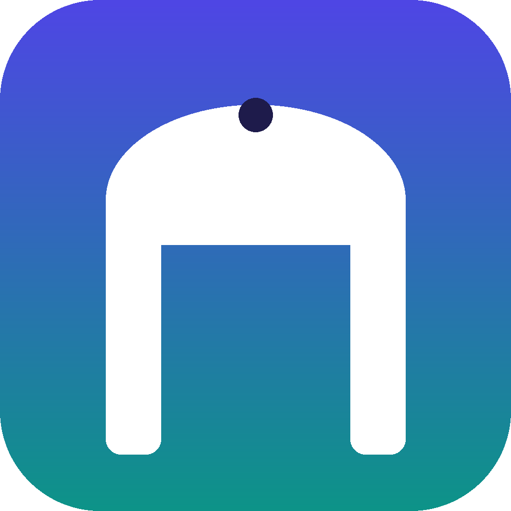

# ZeroGate

  

[English](README.md) | [Português](README.br.md) | Español

Aplicación en Flutter para gestionar Cloudflare Zero Trust directamente desde el móvil o el escritorio: túneles (Cloudflare Tunnel), sus rutas (Public Hostname) y Access Apps con sus políticas — sin necesidad de abrir el dashboard.

> Proyecto hermano de [Cloudflare DNS Manager](https://github.com/Tacioandrade/cloudflare-dns-manager), reutilizando la misma base de autenticación local y arquitectura Flutter.

Este README contiene la información compartida entre las plataformas. Para comandos de build, pruebas y detalles específicos, usa las guías por sistema operativo:

- [Android](README-Android.md)
- [Linux](README-Linux.md)
- [Windows](README-Windows.md)
- [iOS](README-iOS.md)
- [macOS](README-macOS.md)

## Funcionalidades

- Autenticación local por contraseña, con inicio de sesión biométrico en las plataformas que lo permiten.
- Cierre de sesión automático al cerrar y volver a abrir la aplicación, exigiendo un nuevo inicio de sesión.
- Selección/cambio entre las cuentas de Cloudflare que el token puede ver.
- Lista de túneles Cloudflare Tunnel con estado (saludable, degradado, inactivo) y conectores activos.
- Editor de rutas (Public Hostname / ingress rules) de cada túnel: crear, editar y eliminar asignaciones de hostname → servicio local, con selector de tipo de destino (http, https, tcp, ssh, rdp, smb, unix, unix+tls) y configuraciones avanzadas de HTTP/HTTPS (verificación de TLS/SSL del destino, SNI, encabezado Host, HTTP/2, tiempos de espera, keep-alive, proxy).
- Lista de Access Apps (self-hosted) con creación, edición de nombre/dominio/duración de sesión y eliminación.
- Editor de políticas de Access por app: acción (Permitir/Bloquear/Bypass/Service Auth) y reglas Incluir/Excluir/Exigir para los selectores más comunes (correo, dominio de correo, todos, IP). Las reglas con selectores no admitidos por el editor se conservan sin cambios.
- Tema claro, oscuro o automático según el sistema.
- Interfaz en portugués e inglés.
- Visualización del changelog dentro de la aplicación.

## Acceso

En el primer uso, la aplicación abre la pantalla de creación de contraseña. Después, cada nueva ejecución de la app exige iniciar sesión de nuevo.

La sesión autenticada existe solo en memoria. La contraseña de la app no se guarda en texto claro; solo se guarda un hash PBKDF2-HMAC-SHA256 con salt aleatorio en el almacenamiento seguro de la plataforma. El token de Cloudflare también se guarda de forma segura. El tema, el idioma y la cuenta seleccionada se guardan localmente en preferencias normales.

## Token de la API de Cloudflare

1. Inicia sesión en la aplicación.
2. Abre **Configuración**.
3. Pega tu [Cloudflare API Token](https://dash.cloudflare.com/profile/api-tokens).
4. Pulsa **Probar** para validarlo.
5. Pulsa **Guardar**.

Crea un token personalizado con los siguientes permisos:

| Alcance | Permiso | Nivel |
|---|---|---|
| Account | `Cloudflare Tunnel` | Lectura, Edición |
| Account | `Access: Apps and Policies` | Lectura, Edición |
| Account | `Account Settings` | Lectura |
| User | `Memberships` | Lectura |

Los dos primeros dan acceso a los túneles/rutas y a los Access Apps. Los dos últimos (`Account Settings` y `Memberships`) son los que hacen que la(s) cuenta(s) aparezcan en el selector de cuenta de la app — sin ellos, la prueba de conexión pasa, pero la lista de cuentas queda vacía.

Al crear el token, en **Account Resources** selecciona todas las cuentas que quieras gestionar desde esta app — la app lista esas cuentas y permite cambiar entre ellas. Esto evita usar la Global API Key (acceso irrestricto a toda la cuenta de Cloudflare), a favor de un token con alcance explícito.

## Arquitectura

- Framework: Flutter / Dart
- Estado local no sensible: `shared_preferences`
- Secretos locales: `flutter_secure_storage`
- Autenticación biométrica: `local_auth`, cuando la plataforma lo permite
- Comunicación de red: `http`, directo a `api.cloudflare.com/client/v4`
- Apertura de enlaces externos: `url_launcher`

## Build automático (GitHub Actions)

- **CI** (`.github/workflows/ci.yml`): se ejecuta en cada push/PR a `main`. Ejecuta `flutter analyze` + `flutter test` y, si pasa, compila Android (debug, dividido por ABI), Linux, macOS y Windows, publicando cada uno como *artifact* del workflow (pestaña **Actions** del repositorio) — útil para descargar y probar cualquier commit sin esperar una release.
- **Release** (`.github/workflows/release.yml`): se dispara al empujar una etiqueta de versión (ej.: `git tag 1.0.0 && git push origin 1.0.0` — sin `v` al inicio, misma convención usada en los demás proyectos del autor). Crea la [GitHub Release](https://github.com/junglivre/ZeroGate/releases) usando la sección equivalente de `CHANGELOG.md` como notas, luego compila las cuatro plataformas en modo release y adjunta los archivos a ella.
- **Firma de Android**: los APKs de release se firman con un keystore de subida persistente, decodificado en tiempo de compilación a partir de los secrets `ANDROID_KEYSTORE_BASE64`, `ANDROID_KEYSTORE_PASSWORD`, `ANDROID_KEY_ALIAS` y `ANDROID_KEY_PASSWORD` — nunca se sube al repositorio. Es la misma clave de subida usada en las demás apps del autor (así funciona Play App Signing: la clave de subida solo autentica el envío, Google gestiona la clave de firma real de cada app). Como la clave es persistente, los APKs de releases consecutivas se instalan uno sobre otro como actualización.

## Alcance y limitaciones conocidas

- Las rutas gestionadas son las reglas de ingress/Public Hostname del túnel (lo que aparece en la pestaña "Public Hostname" del dashboard). La app no gestiona el enrutamiento de red privada por CIDR/hostname (`teamnet/routes`, usado por WARP/Cloudflare Mesh).
- Los conectores del túnel son de solo lectura — los gestiona el daemon `cloudflared`, no esta app.
- El editor de políticas de Access cubre los selectores más comunes (correo, dominio de correo, todos, IP). Los selectores más avanzados (grupos de IdP, postura del dispositivo, geolocalización, service tokens) todavía requieren el dashboard de Cloudflare; la app conserva esas reglas en vez de descartarlas.

## Estructura de las guías

- `README-Android.md`: Documentación de build y detalles de la versión para Android.
- `README-Linux.md`: Documentación de build y detalles de la versión para Linux.
- `README-Windows.md`: Documentación de build y detalles de la versión para Windows.
- `README-iOS.md`: Documentación de build y detalles de la versión para iOS.
- `README-macOS.md`: Documentación de build y detalles de la versión para macOS.

## Problema conocido

Windows requiere Microsoft Visual C++ Redistributable 2015–2022 instalado para ejecutarse. Sin este runtime, Windows puede mostrar un error indicando que faltan las DLL `MSVCP140.dll`, `VCRUNTIME140.dll` o `VCRUNTIME140_1.dll`. Instálalo desde la página oficial de Microsoft: [Latest supported Visual C++ Redistributable downloads](https://learn.microsoft.com/es-es/cpp/windows/latest-supported-vc-redist).

## Licencia

MIT
